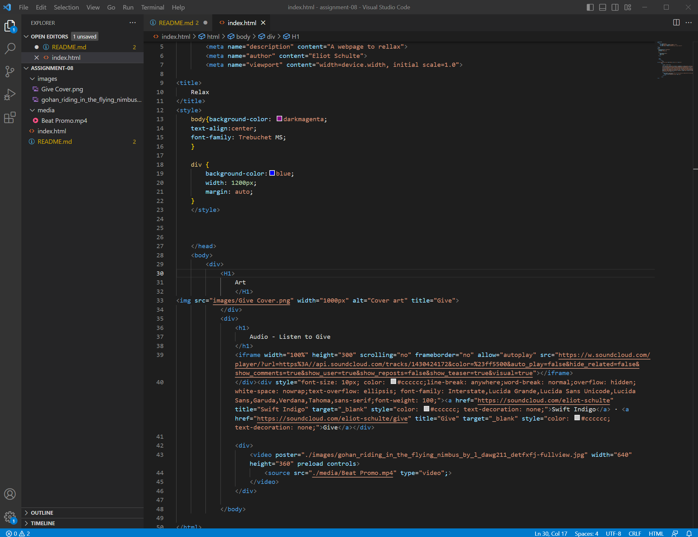

An affordance is what a user can do with an object based on the user's capabilities.

An advantage of using a website like Youtube to host your videos would be that the website already had a lot of people using it. It also has a few simple editing option that you can use once you upload your video, and provides services such as close captions. A disadvantage would be the risk of breaking the websites policies and getting your video taken down, as well as not being able to stick out due to how many content creators are using these websites.

